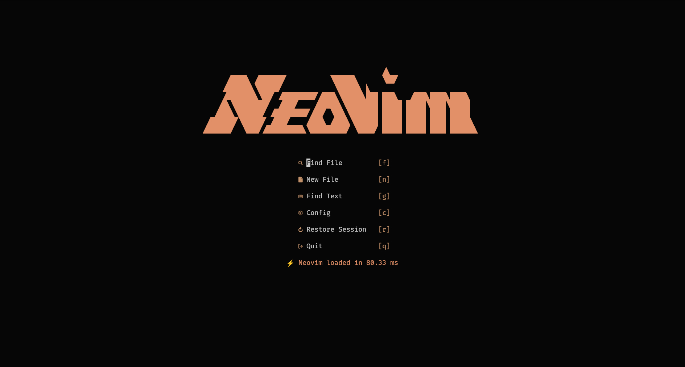
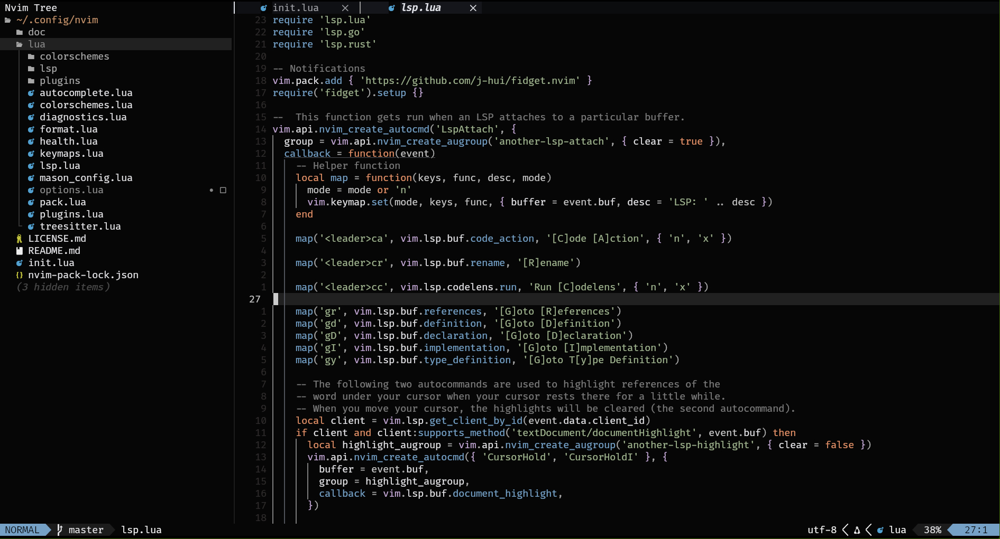

<div align="center">

# Another Neovim Config




</div>

## About

This is my personal Neovim configuration, built on top of [kickstart.nvim](https://github.com/nvim-lua/kickstart.nvim) and heavily inspired by [LazyVim](https://www.lazyvim.org/).

The structure is modular (split across several files inside `lua/`), unlike the single `init.lua` of the original kickstart, which makes it easier to add, remove, or tweak any part of the config (LSP, autocomplete, formatting, treesitter, plugins, etc).

## Dependencies

Before installing, make sure you have the following:

- **Neovim** `0.12.4` or newer (older versions may work)
- `git`
- `make`
- `unzip`
- A C compiler (`gcc`)
- [ripgrep](https://github.com/BurntSushi/ripgrep#installation) — used for search (`<leader>sg`)
- [fd-find](https://github.com/sharkdp/fd#installation)
- A clipboard tool (xclip/xsel/win32yank, depending on your OS)
- A [Nerd Font](https://www.nerdfonts.com/) installed and set in your terminal, for icons to render correctly

## Installation

1. Back up your current Neovim configuration, if you have one:

   ```sh
   mv ~/.config/nvim ~/.config/nvim.bak
   mv ~/.local/share/nvim ~/.local/share/nvim.bak
   ```

2. Clone this repository into your Neovim config folder:

   ```sh
   git clone https://github.com/anotherlusitano/neovim.git "${XDG_CONFIG_HOME:-$HOME/.config}"/nvim
   ```

3. Open Neovim:

   ```sh
   nvim
   ```

4. On first launch, `vim.pack` will automatically start installing all plugins. Accept the install prompts as they appear until the process finishes.

5. Restart Neovim and you're good to go.

## Usage

This config follows many of the same patterns and shortcuts as LazyVim, so if you're already familiar with LazyVim, you'll recognize most of the keymaps.

`<leader>` is mapped to `<space>`.

### Discovering commands

If you're ever unsure what the shortcut for something is, you have these two commands:

| Keymap | Action |
| --- | --- |
| `<leader>sk` | Search for available keymaps/commands |
| `<leader>sg` | Grep search for text across the project's files |

### Some core keymaps

| Keymap | Action |
| --- | --- |
| `<leader>ff` | Find files |
| `<leader>e`  | Open/Toggle Neo-tree |
| `<leader>ft` | Open the Terminal |
| `<leader>bd` | Close the current buffer |
| `<leader>gg` | Open Lazygit |
| `<leader>qq` | Quit Neovim |
| `<C-h>` / `<C-l>` | Move between windows (left/right) |
| `<S-h>` / `<S-l>` | Switch between buffers (previous/next) |

### Config structure

```
.
├── init.lua             # Entry point
├── lua
│   ├── autocomplete.lua # Autocomplete setup
│   ├── colorschemes.lua # Colorscheme(s)
│   ├── diagnostics.lua  # LSP diagnostics setup
│   ├── format.lua       # Code formatting
│   ├── health.lua       # Config health checks
│   ├── keymaps.lua      # All keymaps
│   ├── lsp.lua          # General LSP setup
│   ├── lsp/             # Per-language LSP configs (go, lua, rust, ...)
│   ├── mason_config.lua # Mason setup
│   ├── options.lua      # General Neovim options
│   ├── pack.lua         # Plugin management (vim.pack)
│   ├── plugins.lua      # Plugin list/loading
│   ├── plugins/         # Individual plugin configs
│   └── treesitter.lua   # Treesitter setup
├── .stylua.toml         # Stylua config
└── nvim-pack-lock.json  # Plugin lockfile
```

Each file under `lua/` handles a single responsibility, making it easy to find and change exactly what you need without touching anything else.
